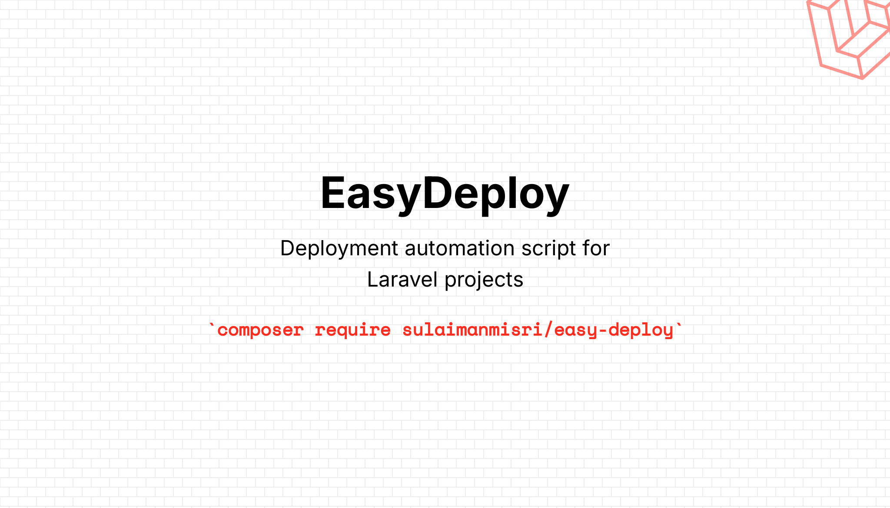

## Easy Deploy for Laravel Application
Easy Deploy is a Laravel package that simplifies deployment automation. It combines common tasks like migrations, cache management, and queue restarts into a single Artisan command, ensuring smooth and efficient deployments with minimal effort

## Prerequisites
* Laravel 9.x or higher
* PHP 7.3 or higher

## Installation
1. Install the package via Composer
```bash
composer require sulaimanmisri/easy-deploy
```

2. Run the installation wizard:
```bash
php artisan easy-deploy:install
```

That's it for the installation. Your application is ready to run the script.

## Run the deployment automation command:
```bash
php artisan easy-deploy:run
```

## Example Integration with CI/CD Pipelines
Simply add the command to your CI/CD pipeline script:
```yaml
php artisan easy-deploy:run
```

## "What kind of command does this package run for me?"
* You can check the default commands in this page [in this page](docs/default-command.md)

## Adding a custom command
To add a custom command, edit the `commands` array in the `easy-deploy.php` config file:
```php
'commands' => [
    'php artisan migrate --force',
    'php artisan cache:clear',
    'your-custom-command',
],
```

## About the Author
Hi, I'm Sulaiman Misri. Currently I'm working as a Senior Executive in Kuala Lumpur Malaysia. If you find this package useful, feel free to check out my [portfolio](https://sulaimanmisri.com) for more information about my freelance services.