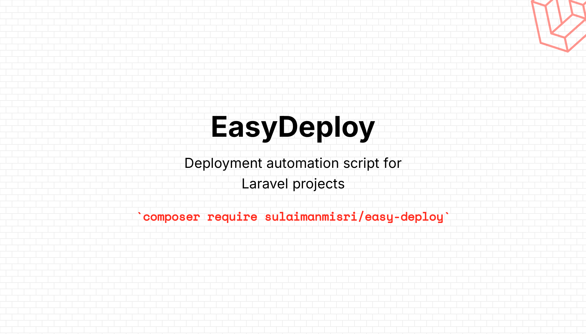

# Easy Deploy for Laravel Application
Easy Deploy is a Laravel package that simplifies deployment automation. It combines common tasks like migrations, cache management, and queue restarts into a single Artisan command, ensuring smooth and efficient deployments with minimal effort

## About the Author
Hi, I'm Sulaiman Misri. Currently I'm working as a Senior Full Stack Engineer at one of the Big Four Companies in Malaysia (Property). If you find this package useful, feel free to check out my [portfolio](https://sulaimanmisri.com) for more information about me and my freelance services.

## Table of Contents

- [Prerequisites](#prerequisites)
- [Installation](#installation)
- [Usage](#usage)
- [Configuration](#configuration)
- [CI/CD Integration](#cicd-integration)
- [Testing](#testing)
- [Contributing](#contributing)
- [About the Author](#about-the-author)

## Prerequisites
* Laravel 9.x or higher
* PHP 7.3 or higher (Laravel 12 need to use PHP version 8.2 minimum)

## Installation
1. Install the package via Composer
```bash
composer require sulaimanmisri/easy-deploy
```

2. Run the installation wizard:
```bash
php artisan easy-deploy:install
```

That's it for the installation. Your application is ready to run the script.

## Usage

### Run the deployment automation command:
```bash
php artisan easy-deploy:run
```

## Configuration

### "What kind of command does this package run for me?"
* You can check the default commands in this page [in this page](docs/default-command.md)

### Adding a custom command
To add a custom command, edit the `commands` array in the `easy-deploy.php` config file:
```php
'commands' => [
    'php artisan migrate --force',
    'php artisan cache:clear',
    'your-custom-command',
],
```

## CI/CD Integration

### Example Integration with CI/CD Pipelines
Simply add the command to your CI/CD pipeline script:
```yaml
# GitHub Actions example
- name: Deploy Application
  run: php artisan easy-deploy:run

# GitLab CI example
deploy:
  script:
    - php artisan easy-deploy:run

# Jenkins example
sh 'php artisan easy-deploy:run'
```

## Testing

### Running Tests
This package comes with comprehensive tests to ensure reliability. To run the tests:

```bash
# Install dev dependencies first
composer install

# Run all tests
composer test

# Or run tests directly with PHPUnit
./vendor/bin/phpunit
```

### Test Groups
Tests are organized into groups for better control:

```bash
# Run only core feature tests
./vendor/bin/phpunit --group=core

# Run only unit tests
./vendor/bin/phpunit tests/Unit/

# Run only feature tests
./vendor/bin/phpunit tests/Feature/
```

### Coverage Report
Generate a detailed coverage report to see test coverage:

```bash
# Generate HTML coverage report
./vendor/bin/phpunit --coverage-html coverage

# View coverage report
open coverage/index.html
```

### Test Structure
The package includes:
- **Unit Tests**: Test individual classes and methods
- **Feature Tests**: Test complete workflows and integrations
- **Configuration Tests**: Validate config file structure and defaults
- **Command Tests**: Test Artisan commands execution

### Contributing Tests
When contributing to this package, please ensure:
1. All new features have corresponding tests
2. Tests follow the existing patterns using `#[Test]` attributes
3. Feature tests are marked with `#[Group('core')]`
4. Maintain 100% code coverage for new code

### Testing Your Configuration
You can test your deployment configuration without running actual deployment:

```bash
# Test with empty commands (should show error message)
php artisan config:set easy-deploy.commands "[]"
php artisan easy-deploy:run

# Test with valid commands
php artisan config:set easy-deploy.commands '["php --version", "composer --version"]'
php artisan easy-deploy:run

# Reset to defaults
php artisan config:clear
```

### Debugging Failed Tests
If tests fail in your environment:

1. **Check PHP version compatibility**:
   ```bash
   php --version  # Should be 7.3+ for Laravel 9-11, 8.2+ for Laravel 12
   ```

2. **Verify Composer dependencies**:
   ```bash
   composer validate
   composer install --no-dev --optimize-autoloader
   ```

3. **Run specific failing test**:
   ```bash
   ./vendor/bin/phpunit tests/Feature/DeploymentCommandTest.php --filter="deployment_command_executes_successfully"
   ```

4. **Clear any cached files**:
   ```bash
   php artisan config:clear
   php artisan cache:clear
   ```

## Contributing

We welcome contributions to Easy Deploy! Here's how you can help:

### Development Setup

1. **Fork and clone the repository**:
   ```bash
   git clone https://github.com/your-username/easy-deploy.git
   cd easy-deploy
   ```

2. **Install dependencies**:
   ```bash
   composer install
   ```

3. **Run tests to ensure everything works**:
   ```bash
   composer test
   ```

### Making Changes

1. **Create a feature branch**:
   ```bash
   git checkout -b feature/your-feature-name
   ```

2. **Make your changes and add tests**:
   - Add new features with corresponding tests
   - Update existing tests if needed
   - Ensure all tests pass

3. **Follow coding standards**:
   - Use PSR-12 coding standard
   - Add proper DocBlocks
   - Use `#[Test]` attributes for test methods
   - Mark feature tests with `#[Group('core')]`

4. **Submit a pull request**:
   - Provide a clear description of your changes
   - Include any relevant issue numbers
   - Make sure CI tests pass

### Reporting Issues

If you find a bug or have a feature request:

1. **Check existing issues** to avoid duplicates
2. **Provide detailed information**:
   - Laravel version
   - PHP version  
   - Steps to reproduce
   - Expected vs actual behavior
3. **Include relevant code samples** if applicable